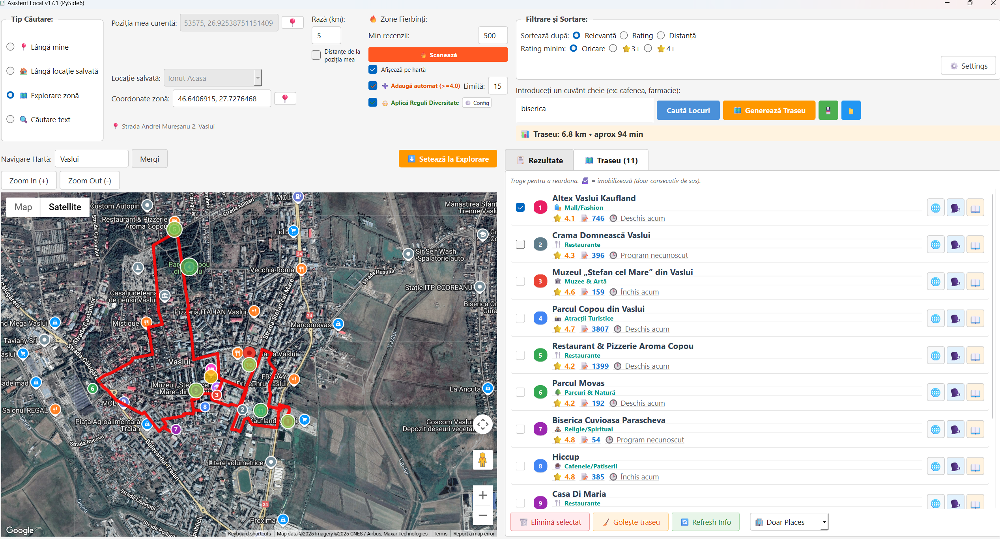

# 🗺️ Asistent Local Pro

<div align="center">


**Planifică explorări locale inteligente cu AI și hartă interactivă**

[Features](#-features) • [Installation](#-installation) • [Usage](#-usage) • [Screenshots](#-screenshots) • [Contributing](#-contributing)

</div>

---

## 📋 Despre Proiect

**Asistent Local Pro** este o aplicație desktop modernă care îți permite să descoperi, planifici și optimizezi explorări în zona ta folosind Google Maps API, inteligență artificială (Gemini AI) și o interfață intuitivă.

Perfect pentru:
- 🏙️ Explorarea sistematică a orașului
- 🍽️ Găsirea celor mai bune restaurante/cafenele
- 🗺️ Planificarea turelor turistice optime
- 🔥 Identificarea "hotspot-urilor" populare
- 📊 Analizarea recenziilor cu AI


---



## ✨ Features

### 🔍 Căutare & Descoperire
- **Căutare inteligentă** în funcție de tip (lângă tine, locație salvată, zonă explorare)
- **Scanare hotspots** - găsește automat zonele fierbinți cu multe recenzii
- **Filtrare avansată** - rating minim, sortare după relevanță/distanță/rating
- **Informații detaliate** - rating, recenzii, program, telefon, website

### 🗺️ Hartă Interactivă
- **Google Maps integrat** - hartă completă în aplicație
- **Tipuri multiple** - roadmap, satellite, hybrid, terrain
- **Meniu contextual** - click dreapta pentru acțiuni rapide
- **Markere colorate** - vizualizare clară a traseelor
- **Hotspots vizuali** - cercuri colorate după rating și popularitate

### 🚗 Optimizare Traseu
- **Generare traseu optimizat** - algoritm TSP pentru cea mai eficientă rută
- **Puncte intermediare** - adaugă waypoint-uri custom pe hartă
- **Drag & drop reordonare** - organizează locațiile după preferință
- **Blocare puncte** - fixează ordinea pentru anumite locații
- **Calcul distanță/timp** - info completă pentru fiecare segment
- **Salvare/încărcare trasee** - păstrează planurile pentru mai târziu

### 🤖 Inteligență Artificială
- **Rezumat AI recenzii** - Gemini AI analizează sute de recenzii instant
- **Info istorică** - context cultural și istoric despre locații
- **Puncte forte/slabe** - analiza sintetizată a opiniilor clienților
- **Recomandări personalizate** - pentru cine e potrivit locul

### 🎨 Interfață Modernă v2.0
- **Design premium 2025** - gradient buttons, backdrop blur, smooth animations
- **Material Design 3** inspired - shadows, rounded corners, modern colors
- **Responsive layout** - adaptabil la diferite rezoluții
- **Dark mode ready** - pregătit pentru mod întunecat (coming soon)

---

## 🚀 Installation

### Prerequisites

```bash
Python 3.8+
pip (Python package manager)
```

### Setup

1. **Clone repository**
```bash
git clone https://github.com/yourusername/asistent-local-pro.git
cd asistent-local-pro
```

2. **Create virtual environment** (recomandat)
```bash
python -m venv venv

# Windows
venv\Scripts\activate

# macOS/Linux
source venv/bin/activate
```

3. **Install dependencies**
```bash
pip install -r requirements.txt
```

4. **Configure API Keys**

Creează un fișier `.env` în root folder:

```env
GOOGLE_API_KEY=your_google_maps_api_key_here
```

**Obține API Key Google Maps:**
- Accesează [Google Cloud Console](https://console.cloud.google.com/)
- Activează: Maps JavaScript API, Places API, Directions API, Distance Matrix API, Geocoding API
- Creează API Key și adaugă-l în `.env`

5. **Run application**
```bash
python test_places_redesign.py
```

---

## 📖 Usage

### 1. Căutare Locuri

#### Căutare Lângă Mine
1. Click pe butonul **📍** pentru a obține coordonatele curente
2. Introdu keyword (ex: "restaurant", "cafenea", "muzeu")
3. Ajustează raza de căutare (km)
4. Click **🔍 Caută Locuri**

#### Scanare Hotspots
1. Setează **poziția** sau **zona de explorare**
2. Configurează **numărul minim de recenzii** (ex: 500)
3. Click **🔥 Scanează Zone**
4. Vezi pe hartă toate locurile populare din zonă

### 2. Planificare Traseu

1. **Selectează locații** - bifează locurile dorite din rezultate
2. **Adaugă waypoints** - click dreapta pe hartă → "Adaugă la Traseu"
3. **Reordonează** - drag & drop în tab-ul "🗺️ Traseu"
4. **Blochează ordinea** - bifează ☑️ pentru puncte fixe
5. **Generează** - click **🗺️ Generează Traseu**
6. **Vizualizează** - vezi traseul roșu și markerele colorate

### 3. Meniu Contextual (Click Dreapta pe Hartă)

- **➕ Adaugă la Traseu** - creează waypoint custom
- **📍 Setează ca poziție curentă** - actualizează locația ta
- **🎯 Setează ca zonă de explorare** - schimbă zona de căutare

### 4. Analiză AI

1. Click pe **🗣️ Opinii** la orice locație
2. Așteaptă analiza AI (Gemini)
3. Citește:
   - Rezumat general
   - Puncte forte
   - Puncte slabe
   - Recomandări

---

## 🖼️ Screenshots

> **Note:** Adaugă screenshots în folder `screenshots/` și actualizează path-urile

### Main Interface

*Interfața principală cu hartă interactivă și controale moderne*

### Hotspots Scanning

*Scanare zone fierbinți - vizualizare cercuri colorate după popularitate*

### Route Planning

*Planificare traseu optimizat cu drag & drop reordonare*

### AI Review Summary

*Rezumat AI al recenziilor - analiză inteligentă instant*

---

## 🛠️ Tech Stack

### Frontend
- **PySide6** (Qt6) - UI framework modern
- **QWebEngineView** - Google Maps integration
- **Custom CSS** - Modern design system

### Backend
- **Python 3.8+** - Core language
- **Google Maps APIs** - Places, Directions, Distance Matrix, Geocoding
- **Gemini AI** - Natural language processing pentru analiza recenziilor

### Libraries
```python
PySide6>=6.0.0
googlemaps>=4.10.0
requests>=2.31.0
python-dotenv>=1.0.0
```

---

## 📁 Project Structure

```
asistent-local-pro/
│
├── test_places_redesign.py    # Main application
├── map_template.html           # Google Maps HTML template
├── .env                        # API keys (nu se commitează)
├── .env.example               # Template pentru .env
├── requirements.txt           # Python dependencies
├── app_state.json            # Salvare stare aplicație
│
├── saved_routes/             # Trasee salvate (JSON)
│   └── *.json
│
├── screenshots/              # Screenshots pentru README
│   └── *.png
│
└── README.md                 # Acest fișier
```

---

## 🎯 Roadmap

- [x] Căutare multiplă (my position, saved location, explore)
- [x] Optimizare traseu TSP
- [x] Rezumat AI recenzii
- [x] Hotspots scanning
- [x] Waypoints custom
- [x] Modern UI redesign v2.0
- [ ] Dark mode
- [ ] Export traseu ca GPX
- [ ] Integrare Waze/Apple Maps
- [ ] Salvare favorite în cloud
- [ ] Sincronizare cross-device
- [ ] Mobile app companion

---

## 🤝 Contributing

Contribuțiile sunt binevenite! 

### Cum să contribui:

1. **Fork** repository-ul
2. **Create** branch pentru feature (`git checkout -b feature/AmazingFeature`)
3. **Commit** changes (`git commit -m 'Add some AmazingFeature'`)
4. **Push** to branch (`git push origin feature/AmazingFeature`)
5. **Open** Pull Request

### Guidelines:
- Urmează stilul de cod existent
- Adaugă comentarii pentru logica complexă
- Testează înainte de PR
- Actualizează documentația dacă e necesar

---

## 🐛 Bug Reports

Găsit un bug? [Deschide un issue](https://github.com/yourusername/asistent-local-pro/issues) cu:
- Descriere detaliată
- Pași de reproducere
- Comportament așteptat vs actual
- Screenshots (dacă e aplicabil)
- Versiune Python & OS

---

## 💡 Feature Requests

Ai o idee pentru o funcționalitate nouă? 
[Deschide un issue](https://github.com/yourusername/asistent-local-pro/issues) cu tag `enhancement`!

---

## 📄 License

Acest proiect este licențiat sub **MIT License** - vezi fișierul [LICENSE](LICENSE) pentru detalii.

```
MIT License

Copyright (c) 2025 [Your Name]

Permission is hereby granted, free of charge, to any person obtaining a copy
of this software and associated documentation files (the "Software"), to deal
in the Software without restriction...
```

---

## 👨‍💻 Author

**[Your Name]**

- GitHub: [@yourusername](https://github.com/yourusername)
- Email: your.email@example.com

---

## 🙏 Acknowledgments

- [Google Maps Platform](https://developers.google.com/maps) - Hartă și API-uri
- [Google Gemini AI](https://ai.google.dev/) - Natural language processing
- [PySide6](https://doc.qt.io/qtforpython/) - Qt framework pentru Python
- [Material Design](https://material.io/) - Design inspiration

---

## ⭐ Star History

[](https://star-history.com/#yourusername/asistent-local-pro&Date)

---

<div align="center">

**Dacă îți place proiectul, dă un ⭐ pe GitHub!**

Made with ❤️ in România 🇷🇴

</div>
